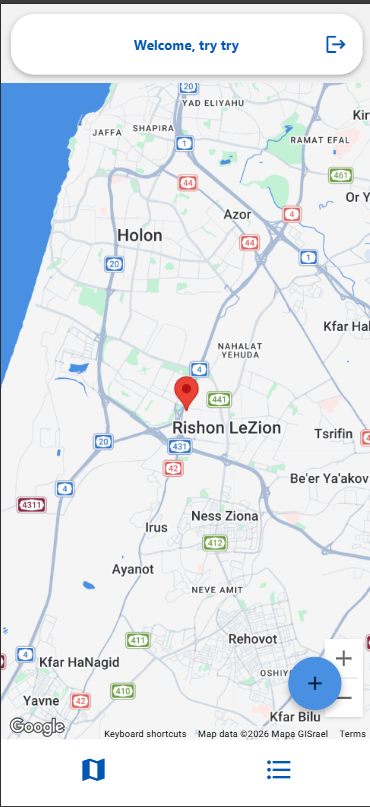
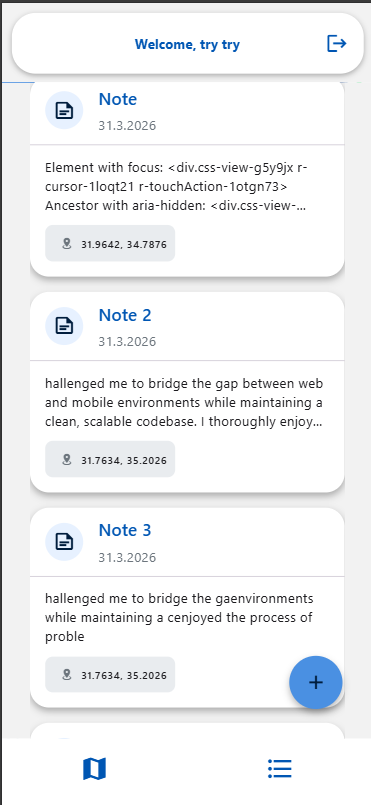

# NotesMT - Location-Based Notes App

A cross-platform mobile and web application built with React Native and Expo. NotesMT allows users to create, manage, and visualize notes on an interactive map, featuring real-time synchronization with Firebase.

## Features
- User Authentication: Secure Sign-Up and Login via Firebase Auth.

- Interactive Map: View and add notes based on geographic locations.

- Real-Time Sync: Instant updates across the app using Firebase Firestore onSnapshot.

- Cross-Platform: Optimized for both iOS/Android (Native) and Web.

## Tech Stack
- Framework: React Native & Expo SDK (TypeScript) 

- Database: Cloud Firestore (NoSQL DB) 

- Authentication: Firebase SDK 

- Maps: Google maps 

- Navigation: Expo-router 

- UI Library: React Native Paper

## Architecture Decisions

- ### Separation of Concerns (Service Layer)
   All Firebase logic is encapsulato launch the app in Expo Goed within the **/services** directory. This ensures that UI components remain "dumb" and focused only on rendering, while data fetching and business logic are handled independently.

- ### Real-Time Data Flow (Custom Hooks)
   The app utilizes a useNotes custom hook that implements Firebase's onSnapshot listener. This provides a Single Source of Truth, ensuring that the Map View and List View are always in sync without redundant API calls.

- ### Platform-Specific Map Implementation
   Due to library limitations between Mobile and Web, the project uses Platform-Specific Extensions (`map.native.tsx` and `map.web.tsx`). This allows the app to use the Google Maps SDK on mobile and the Google Maps JS API on the web seamlessly

## Getting Started
### Prerequisites
- Node.js
- - Copy the contents of [example.env](./example.env) to a new file named appsettings.json and fill in the details.

### Installation
1. Clone the repository:

   ```
   $ git clone https://github.com/naama-git/NotesMT.git
   ```

2. Install Dependencies:

   ```
   $ npm install
   ```
3. Start the development server:

   ```
   $ npx expo start
   ```
   then press `w` for WEB or `a` for android.
   You can also scan the QR code generated in your terminal to o launch the app in Expo Go in your mobile.

--- 


